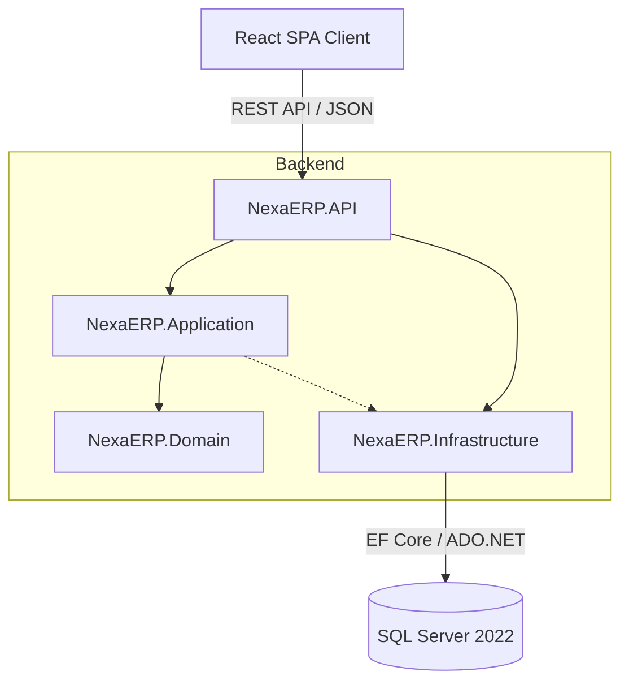
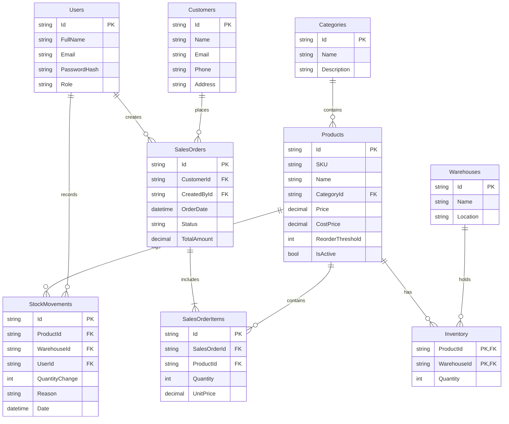

# NexaERP Architecture

NexaERP is built using a modern, multi-tier architecture to ensure scalability, maintainability, and clean separation of concerns.

## System Architecture

### Layers Description
- **Client (Frontend)**: Vite + React SPA built with TypeScript. Uses `axios` for API calls and `zustand` for state management.
- **NexaERP.API**: The presentation layer containing ASP.NET Core Controllers, JWT authentication, and Swagger documentation.
- **NexaERP.Application**: The application logic layer. Contains Data Transfer Objects (DTOs), business service interfaces, and orchestration logic.
- **NexaERP.Domain**: The core domain model. Contains Entities, Enums, and domain exceptions (e.g., `BusinessException`).
- **NexaERP.Infrastructure**: The data access layer. Implements Application interfaces using Entity Framework Core, handles DbContext, migrations, and direct ADO.NET stored procedure calls.

## Database Schema

